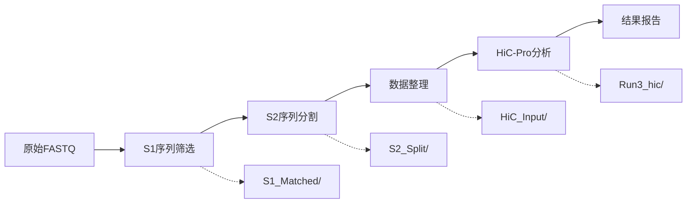

# 第二章：S1S2HiC系统详解 🧬

> 🎯 **本章目标**：掌握S1S2HiC系统的完整使用方法，从配置到分析一应俱全

## 2.1 系统概述

S1S2HiC系统是专为生物信息学Hi-C数据分析设计的一站式解决方案，将复杂的Hi-C数据处理流程整合为自动化工具。

### 🔄 完整流程



### ✨ 核心特性

| 特性 | 说明 | 优势 |
|------|------|------|
| 🤖 **一键分析** | 从原始数据到结果报告 | 零手工操作 |
| 📋 **配置驱动** | YAML配置文件控制全流程 | 参数管理便捷 |
| 🔄 **流程控制** | 支持跳过特定步骤 | 中断恢复友好 |
| 📊 **详细报告** | 自动生成处理统计 | 质控信息完整 |
| ⚡ **并行处理** | 多核加速处理 | 处理速度快 |

---

## 2.2 两种使用模式

### 模式1：简易配置文件模式 ⚡ （推荐新手）

```bash
# 1. 生成配置模板
./run_s1s2hic_auto.sh --create-template

# 2. 编辑配置文件
nano configs/templates/simple_config.conf
```

**配置文件示例：**
```ini
# S1S2HiC 简易配置文件
PROJECT_NAME=my_hic_analysis_20240701
GROUPS=1,2,3
DATA_ROOT=/path/to/your/data
```

```bash
# 3. 运行分析
./run_s1s2hic_auto.sh configs/templates/simple_config.conf
```

### 模式2：YAML配置文件模式 🎯 （推荐生产环境）

```bash
# 1. 进入src目录
cd src/

# 2. 生成YAML配置模板
python S1S2HiC_Pipeline.py --generate-config my_config.yaml

# 3. 编辑配置文件
nano my_config.yaml

# 4. 运行完整流程
python S1S2HiC_Pipeline.py -c my_config.yaml
```

---

## 2.3 YAML配置文件详解

### 📋 完整配置模板

```yaml
# S1S2HiC 完整配置文件模板
# ===============================

# S1步骤配置 - 序列筛选
S1_config:
  patterns: "ATCGATCG,GCTAGCTA"              # 【必填】搜索序列，逗号分隔
  description: "我的HiC项目"                 # 项目描述
  input_pattern: "*gz"                      # 输入文件匹配模式
  lines_to_process: 100000                  # 处理行数（"all" = 全部）
  jobs: 8                                   # 并行任务数
  output_dir: "S1_Matched"                  # S1输出目录

# S2步骤配置 - 序列分割
S2_config:
  separator1: "GATCATGTCGGAACTGTTGCTTGTCCGACTGATC"  # 第一个分隔符
  separator2: "AGATCGGAAGA"                          # 第二个分隔符
  min_length: 10                                    # 最小序列长度
  output_dir: "S2_Split"                           # S2输出目录

# HiC步骤配置 - HiC-Pro分析
HiC_config:
  input_dir: "HiC_Input"                    # HiC输入目录
  project_name: "MyProject_20240701"        # 项目名称（空则自动生成）
  config_type: 1                           # 配置文件类型（1-3）
  modules: "1,2,3"                         # 运行的模块
  cpu_count: 16                            # CPU数量
  conda_env: "hicpro3"                     # Conda环境

# 流程控制配置
workflow_control:
  skip_s1: false                           # 跳过S1步骤
  skip_s2: false                           # 跳过S2步骤
  skip_hic: false                          # 跳过HiC步骤
```

### 🔧 配置参数详解

#### S1_config 配置项

| 参数 | 类型 | 说明 | 示例 | 必需 |
|------|------|------|------|------|
| `patterns` | 字符串 | **关键参数** 逗号分隔的搜索序列 | `"ATCGATCG,GCTAGCTA"` | ✅ |
| `description` | 字符串 | 项目描述性名称 | `"细胞系A_HiC分析"` | ❌ |
| `input_pattern` | 字符串 | 输入文件匹配模式 | `"*.fastq.gz"` | ❌ |
| `lines_to_process` | 数字/字符串 | 处理行数限制 | `100000` 或 `"all"` | ❌ |
| `jobs` | 数字 | 并行任务数 | `8` | ❌ |
| `output_dir` | 字符串 | S1输出目录 | `"S1_Matched"` | ❌ |

#### S2_config 配置项

| 参数 | 类型 | 说明 | 示例 | 必需 |
|------|------|------|------|------|
| `separator1` | 字符串 | 第一个分隔符序列 | `"GATCATGTCG..."` | ❌ |
| `separator2` | 字符串 | 第二个分隔符序列 | `"AGATCGGAAGA"` | ❌ |
| `min_length` | 数字 | 分割后序列最小长度 | `10` | ❌ |
| `output_dir` | 字符串 | S2输出目录 | `"S2_Split"` | ❌ |

#### HiC_config 配置项

| 参数 | 类型 | 说明 | 示例 | 必需 |
|------|------|------|------|------|
| `input_dir` | 字符串 | HiC输入目录 | `"HiC_Input"` | ❌ |
| `project_name` | 字符串 | 项目名称 | `"MyProject_20240701"` | ❌ |
| `config_type` | 数字 | 配置文件类型（1-3） | `1` | ❌ |
| `modules` | 字符串 | 运行的模块 | `"1,2,3"` | ❌ |
| `cpu_count` | 数字 | CPU数量 | `16` | ❌ |
| `conda_env` | 字符串 | Conda环境名称 | `"hicpro3"` | ❌ |

#### workflow_control 配置项

| 参数 | 类型 | 说明 | 用途 |
|------|------|------|------|
| `skip_s1` | 布尔值 | 跳过S1步骤 | 从S2开始运行 |
| `skip_s2` | 布尔值 | 跳过S2步骤 | 从HiC开始运行 |
| `skip_hic` | 布尔值 | 跳过HiC步骤 | 只做数据预处理 |

---

## 2.4 使用场景示例

### 🧪 场景1：完整流程分析

```yaml
# complete_analysis.yaml
S1_config:
  patterns: "GATCGATC,ATCGATCG,GCTAGCTA"
  description: "完整HiC分析"
  lines_to_process: "all"              # 处理所有数据
  jobs: 8

S2_config:
  min_length: 15                       # 提高质量要求

HiC_config:
  project_name: "Complete_Analysis_20240701"
  cpu_count: 20                        # 更多CPU
  modules: "1,2,3"                     # 完整模块

workflow_control:
  skip_s1: false
  skip_s2: false
  skip_hic: false
```

### 🚀 场景2：快速测试

```yaml
# quick_test.yaml
S1_config:
  patterns: "ATCGATCG,GCTAGCTA"
  description: "快速测试"
  lines_to_process: 10000              # 只处理1万行
  jobs: 4

workflow_control:
  skip_hic: true                       # 跳过HiC分析，只做预处理
```

### 🔄 场景3：中断恢复

```yaml
# resume_analysis.yaml - 从S2开始恢复
S2_config:
  output_dir: "S2_Split"

HiC_config:
  project_name: "Resume_Analysis_20240701"

workflow_control:
  skip_s1: true                        # 跳过已完成的S1
  skip_s2: false
  skip_hic: false
```

### 📊 场景4：大数据处理

```yaml
# big_data.yaml
S1_config:
  patterns: "GATCGATC,ATCGATCG,GCTAGCTA,TTAATTAA"
  description: "大数据集分析"
  lines_to_process: "all"
  jobs: 16                             # 更多并行任务

HiC_config:
  cpu_count: 32                        # 更多CPU
  project_name: "BigData_HiC_20240701"

# 注意：大数据处理建议分步进行
```

---

## 2.5 预设组详解

S1S2HiC系统预设了5个经典实验组，适用于不同的酶切和测序方案：

### 🧬 Group1: MboI+GATC+SeqA (3样本)
- **酶切方案**: MboI酶切
- **识别序列**: GATC
- **测序方案**: SeqA
- **样本数**: 3个
- **推荐场景**: 标准Hi-C实验，数据量大

### 🧪 Group2: MboI+GATC+SeqB (1样本)  
- **酶切方案**: MboI酶切
- **识别序列**: GATC
- **测序方案**: SeqB
- **样本数**: 1个
- **推荐场景**: 快速测试，对照组分析

### ✂️ Group3: MseI+CviQI+TA+SeqA (3样本)
- **酶切方案**: MseI+CviQI双酶切
- **识别序列**: TA
- **测序方案**: SeqA  
- **样本数**: 3个
- **推荐场景**: 双酶切实验，高分辨率分析

### 🔬 Group4: MseI+CviQI+TA+SeqB (1样本)
- **酶切方案**: MseI+CviQI双酶切
- **识别序列**: TA
- **测序方案**: SeqB
- **样本数**: 1个
- **推荐场景**: 双酶切对照组

### 🎯 Group5: MboI+CviQI+GATC+TA+SeqA (1样本)
- **酶切方案**: MboI+CviQI多酶切
- **识别序列**: GATC+TA
- **测序方案**: SeqA
- **样本数**: 1个  
- **推荐场景**: 多酶切实验，特殊研究

### 📋 快速选择指南

| 实验需求 | 推荐组合 | 理由 |
|----------|----------|------|
| 🚀 **快速测试** | `GROUPS=2` | 最快，1个样本 |
| 🧪 **标准分析** | `GROUPS=1,3` | 经典方案，多样本 |
| 🔬 **全面比较** | `GROUPS=1,2,3,4,5` | 所有方案对比 |
| 🎯 **自定义** | 根据酶切方案选择 | 按实验设计 |

---

## 2.6 高级功能

### 🔧 命令行参数覆盖

即使使用配置文件，也可以通过命令行参数覆盖特定设置：

```bash
# 使用配置文件，但覆盖项目名称和CPU数
python S1S2HiC_Pipeline.py \
    -c my_config.yaml \
    --project-name "NewProject_20240701" \
    --hic-cpu 20 \
    --s1-jobs 12
```

### 📊 分步执行模式

```bash
# 第1步：只运行S1（数据筛选）
python S1S2HiC_Pipeline.py -c config.yaml --skip-s2 --skip-hic

# 第2步：只运行S2（数据分割）  
python S1S2HiC_Pipeline.py -c config.yaml --skip-s1 --skip-hic

# 第3步：只运行HiC（分析流程）
python S1S2HiC_Pipeline.py -c config.yaml --skip-s1 --skip-s2
```

### 🎛️ 环境依赖配置

```yaml
# 高级环境配置
HiC_config:
  conda_env: "hicpro3"                 # Conda环境
  conda_path: "/opt/miniconda3"        # Conda安装路径
  hicpro_config: "custom_hicpro.conf" # 自定义HiC-Pro配置
```

---

## 2.7 输出结果详解

### 📁 目录结构

```
工作目录/
├── S1_Matched/                          # S1筛选结果
│   ├── matched_reads_*.fastq.gz        # 匹配的reads
│   └── S1_statistics.txt               # S1统计报告
├── S2_Split/                           # S2分割结果
│   ├── sample_R1.fq.gz                # R1文件
│   ├── sample_R2.fq.gz                # R2文件
│   └── sample_discarded.fq.gz         # 丢弃的reads
├── HiC_Input/                          # HiC输入数据
│   ├── sample_R1.fastq                # 标准化R1
│   └── sample_R2.fastq                # 标准化R2
├── Run3_hic/                           # HiC分析结果
│   ├── hic_results/                    # HiC-Pro输出
│   ├── matrix/                         # 接触矩阵
│   └── plots/                          # 可视化图表
└── S1S2HiC_Complete_Report_20240701.txt # 完整报告
```

### 📊 报告内容

**S1S2HiC完整报告示例：**
```
S1S2HiC流程处理报告
==================

运行时间: 2024-07-01 15:30:22
配置文件: my_config.yaml
项目名称: MyProject_20240701

S1步骤统计:
- 输入文件数: 6
- 处理reads数: 10,000,000
- 匹配reads数: 856,742
- 匹配率: 8.57%

S2步骤统计:
- 输入reads数: 856,742
- 成功分割: 789,234
- 分割成功率: 92.12%
- R1 reads数: 789,234
- R2 reads数: 789,234

HiC步骤统计:
- 有效接触数: 2,345,678
- 去重后接触数: 1,987,543
- 去重率: 84.73%
- 短程接触(<20kb): 45.6%
- 长程接触(>20kb): 54.4%

处理耗时:
- S1步骤: 45分23秒
- S2步骤: 12分45秒  
- HiC步骤: 2小时18分12秒
- 总耗时: 3小时16分20秒
```

---

## 2.8 故障排除

### 🚨 常见问题

#### 问题1：配置文件格式错误
```bash
# 错误信息: YAML语法错误
# 解决方案: 检查YAML语法
python -c "import yaml; yaml.safe_load(open('my_config.yaml'))"

# 重新生成配置文件模板
python S1S2HiC_Pipeline.py --generate-config new_config.yaml
```

#### 问题2：HiC-Pro环境问题
```bash
# 错误信息: conda环境未找到
# 解决方案: 检查conda环境
conda env list | grep hicpro

# 创建HiC-Pro环境
conda create -n hicpro3 hicpro -c bioconda
```

#### 问题3：中间文件丢失
```bash
# 错误信息: 找不到S1或S2结果
# 解决方案: 使用分步模式重新运行
python S1S2HiC_Pipeline.py -c config.yaml --skip-hic  # 重新生成S1/S2
```

#### 问题4：内存不足
```yaml
# 解决方案: 调整配置减少内存使用
S1_config:
  lines_to_process: 50000              # 减少处理行数
  jobs: 4                              # 减少并行任务

HiC_config:
  cpu_count: 8                         # 减少CPU使用
```

### 🔧 调试技巧

```bash
# 1. 小数据测试
# 先用少量数据测试配置文件
S1_config:
  lines_to_process: 1000               # 只处理1000行

# 2. 分步调试
# 逐步运行，检查每步输出
python S1S2HiC_Pipeline.py -c config.yaml --skip-s2 --skip-hic  # 只运行S1

# 3. 查看详细日志
python S1S2HiC_Pipeline.py -c config.yaml --verbose              # 详细输出

# 4. 检查依赖脚本
ls src/S1_Process_gen.py src/S2_Split.py Scripts/schic_analysis_pipeline.sh
```

---

## 2.9 最佳实践

### 🎯 参数调优建议

#### 硬件配置优化
```yaml
# 内存8GB以下
S1_config:
  jobs: 4
  lines_to_process: 50000

# 内存16GB
S1_config:
  jobs: 8  
  lines_to_process: 100000

# 内存32GB以上
S1_config:
  jobs: 16
  lines_to_process: "all"
```

#### 数据规模配置
```yaml
# 小数据集（<1GB）
workflow_control:
  skip_hic: false                      # 可以运行完整流程

# 大数据集（>10GB）  
S1_config:
  jobs: 16                             # 更多并行
HiC_config:
  cpu_count: 32                        # 更多CPU
```

### 📋 配置文件管理

```bash
# 1. 使用版本控制
configs/
├── production/
│   ├── project_A_v1.yaml
│   ├── project_A_v2.yaml
│   └── project_B_v1.yaml
├── testing/
│   └── quick_test.yaml
└── templates/
    └── standard_template.yaml

# 2. 配置文件命名规范
project_dataset_version_date.yaml
# 例如: neuroblastoma_sample1_v2_20240701.yaml
```

### 🔄 批量处理工作流

```bash
#!/bin/bash
# 批量处理脚本示例

projects=("project_A" "project_B" "project_C")

for project in "${projects[@]}"; do
    echo "处理项目: $project"
    
    # 使用项目特定配置
    python S1S2HiC_Pipeline.py -c "configs/production/${project}.yaml"
    
    # 检查是否成功
    if [ $? -eq 0 ]; then
        echo "项目 $project 处理成功"
    else
        echo "项目 $project 处理失败"
    fi
done
```

---

## 2.10 下一步建议

🎯 **完成本章学习后，您应该能够**：
- ✅ 配置和运行完整的S1S2HiC分析流程
- ✅ 理解各步骤的参数含义和调优方法  
- ✅ 处理常见错误和故障排除
- ✅ 根据实验需求选择合适的预设组

📚 **推荐后续阅读**：
- [第四章 - 配置文件详解](04-configuration.md) - 深入学习配置技巧
- [第五章 - 命令参考](05-commands.md) - 查看完整命令选项
- [第七章 - 故障排除](07-troubleshooting.md) - 解决复杂问题
- [第八章 - 单个工具详解](08-individual-tools.md) - 了解底层工具

---

> 💡 **提示**：S1S2HiC系统的设计理念是"配置一次，运行多次"。建议为不同项目创建标准化的配置文件模板，提高工作效率。 