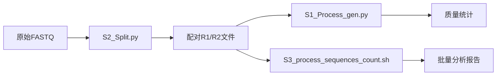

# 第八章：单个工具详解 🛠️

> 🎯 **本章目标**：掌握每个专业工具的独立使用方法，实现精细化数据处理

## 8.1 工具套件总览

本系统包含三个核心专业工具，每个都可以独立使用或组合使用：

### 🧬 工具对比一览

| 工具 | 主要功能 | 适用场景 | 性能特点 |
|------|----------|----------|----------|
| **S1_Process_gen.py** | 序列模式搜索和统计 | 质控分析、特征统计 | 功能全面、详细输出 |
| **S2_Split.py** | FASTQ文件智能分割 | 数据预处理、配对重组 | 专业分割、配对精确 |
| **S3_process_sequences_count.sh** | 高性能批量统计 | 大规模数据、批量处理 | 速度最快、资源消耗低 |

### 🔄 典型工作流程



---

## 8.2 S2分割工具 ✂️

> **专业FASTQ文件分割工具，根据分隔符序列精确分割为配对文件**

### 📋 功能概述

`S2_Split.py` 是专门设计用于处理包含多重结构的测序数据，能够根据指定分隔符将单个FASTQ文件精确分割为配对的R1和R2文件。

### ✨ 核心特性

- 🧬 **智能序列分割**：根据两个分隔符序列精确分割
- 🔄 **反向互补支持**：自动计算并匹配反向互补序列
- 🎯 **多种匹配模式**：支持正向、反向、混合方向匹配
- 👥 **配对保证**：确保输出的R1和R2文件完全配对
- 📏 **长度过滤**：可设置最小序列长度要求
- 📊 **详细统计**：提供全面的处理统计和方向分析

### 🔧 使用方法

#### 基本语法
```bash
cd src/
python S2_Split.py -i <输入文件> -o <输出目录> [选项]
```

#### 参数详解

| 参数 | 类型 | 说明 | 示例 | 必需 |
|------|------|------|------|------|
| `-i, --input` | 文件路径 | 输入的FASTQ.gz文件 | `sample.fastq.gz` | ✅ |
| `-o, --output` | 目录路径 | 输出目录 | `output_dir` | ✅ |
| `--sep1` | 字符串 | 第一个分隔符序列 | `"GATCATGTCG..."` | ❌ |
| `--sep2` | 字符串 | 第二个分隔符序列 | `"AGATCGGAAGA"` | ❌ |
| `--min-length` | 数字 | 最小序列长度 | `10` | ❌ |

#### 默认分隔符

```python
# 默认分隔符设置
separator1 = "GATCATGTCGGAACTGTTGCTTGTCCGACTGATC"
separator2 = "AGATCGGAAGA"
min_length = 10
```

### 📖 使用示例

#### 示例1：基础使用
```bash
# 使用默认分隔符处理文件
python S2_Split.py -i sample.fastq.gz -o output_dir
```

#### 示例2：自定义分隔符
```bash
# 指定自定义的分隔符序列
python S2_Split.py \
    -i sample.fastq.gz \
    -o output_dir \
    --sep1 "ATCGATCGATCG" \
    --sep2 "GCTAGCTAGCTA" \
    --min-length 20
```

#### 示例3：批量处理
```bash
# 批量处理多个文件
for file in *.fastq.gz; do
    echo "处理文件: $file"
    python S2_Split.py \
        -i "$file" \
        -o "split_$(basename $file .fastq.gz)" \
        --min-length 15
done
```

### 🔬 工作原理详解

#### 分割逻辑
```
原始read结构:
[R1序列] + [分隔符1] + [R2序列] + [分隔符2] + [其他序列]
              ↓
输出结果:
R1文件 ← [R1序列]  |  R2文件 ← [R2序列]
```

#### 匹配模式
工具支持四种分隔符匹配模式：

1. **正向匹配**：`sep1_正向 + sep2_正向`
2. **反向匹配**：`sep1_反向互补 + sep2_反向互补`  
3. **混合匹配1**：`sep1_正向 + sep2_反向互补`
4. **混合匹配2**：`sep1_反向互补 + sep2_正向`

### 📊 输出结果

#### 输出文件
| 文件名 | 内容 | 说明 |
|--------|------|------|
| `{basename}_R1.fq.gz` | 第一个序列片段 | 配对的R1 reads |
| `{basename}_R2.fq.gz` | 第二个序列片段 | 配对的R2 reads |
| `{basename}_discarded.fq.gz` | 丢弃的reads | 不符合条件的原始reads |

#### 统计输出示例
```
=== 处理完成统计 ===
总reads数: 100000
成功配对的reads数: 85000
丢弃的reads数: 15000
配对成功率: 85.00%

=== 方向统计 ===
正向匹配 (sep1_fwd + sep2_fwd): 45000
反向匹配 (sep1_rc + sep2_rc): 25000
混合匹配1 (sep1_fwd + sep2_rc): 10000
混合匹配2 (sep1_rc + sep2_fwd): 5000

=== 配对验证 ===
R1文件reads数 = R2文件reads数: True ✓
```

---

## 8.3 S3序列统计工具 🚀

> **高性能批量序列统计工具，支持大规模数据的并行处理**

### 📋 功能概述

`S3_process_sequences_count.sh` 是高效的Bash脚本，专门用于在大量压缩文件中搜索和统计指定序列模式的出现情况。

### ✨ 核心特性

- 🔍 **序列模式搜索**：同时搜索多个指定序列的共现情况
- 🧬 **反向互补分析**：自动计算并统计反向互补序列匹配
- ⚡ **并行处理**：支持多核并行处理，大幅提升效率
- 📊 **统计分析**：提供详细的匹配统计和百分比计算
- 📁 **批量处理**：一次性处理多个gzip压缩文件
- 🎯 **灵活配置**：支持自定义处理行数、输出路径等参数

### 🔧 使用方法

#### 基本语法
```bash
cd src/
./S3_process_sequences_count.sh -p "序列1,序列2,..." [选项]
```

#### 参数详解

| 参数 | 类型 | 说明 | 示例 | 必需 |
|------|------|------|------|------|
| `-p <序列列表>` | 字符串 | 逗号分隔的搜索序列 | `"ATCGATCG,GCTAGCTA"` | ✅ |
| `-d <描述>` | 字符串 | 序列组合的描述名称 | `"我的分析项目"` | ❌ |
| `-i <输入模式>` | 字符串 | 输入.gz文件匹配模式 | `"*gz"` | ❌ |
| `-o <输出文件>` | 文件路径 | 输出TSV文件路径 | `results.tsv` | ❌ |
| `-N <行数>` | 数字/字符串 | 处理行数限制 | `100000` 或 `"all"` | ❌ |
| `-j <任务数>` | 数字 | 并行处理的最大任务数 | `8` | ❌ |

### 📖 使用示例

#### 示例1：基础使用
```bash
# 搜索两个序列的共现情况
./S3_process_sequences_count.sh -p "ATCGATCG,GCTAGCTA"
```

#### 示例2：高级配置
```bash
# 完整参数配置
./S3_process_sequences_count.sh \
    -p "ATCGATCG,GCTAGCTA,TTAATTAA" \
    -d "三序列组合分析" \
    -i "sample_*.fastq.gz" \
    -o "results/analysis_results.tsv" \
    -N 200000 \
    -j 8
```

#### 示例3：处理所有数据
```bash
# 处理每个文件的所有行（不限制行数）
./S3_process_sequences_count.sh \
    -p "ATCGATCG,GCTAGCTA" \
    -N all \
    -d "全文件分析"
```

#### 示例4：批量处理特定文件
```bash
# 只处理特定模式的文件
./S3_process_sequences_count.sh \
    -p "ATCGATCG,GCTAGCTA" \
    -i "experiment_*_R1.fastq.gz" \
    -d "R1文件分析"
```

### 📊 输出结果

#### TSV文件格式
| 列名 | 说明 |
|------|------|
| 样本 | 文件名（去除.gz扩展名） |
| 序列描述 | 用户提供的描述性名称 |
| 查询序列组合 | 搜索的序列列表 |
| 全正向共现行数 | 所有正向序列共同出现的行数 |
| 全反向互补共现行数 | 所有反向互补序列共同出现的行数 |
| 总处理Reads数 | 处理的总reads数量（行数÷4） |
| 全正向比例(%) | 正向匹配的百分比 |
| 全反向互补比例(%) | 反向互补匹配的百分比 |

#### 输出示例
```tsv
样本	序列描述	查询序列组合	全正向共现行数	全反向互补共现行数	总处理Reads数	全正向比例(%)	全反向互补比例(%)
sample1.fastq	测试序列组合	ATCGATCG,GCTAGCTA	1250	890	25000	5.00%	3.56%
sample2.fastq	测试序列组合	ATCGATCG,GCTAGCTA	1100	950	25000	4.40%	3.80%
sample3.fastq	测试序列组合	ATCGATCG,GCTAGCTA	1350	820	25000	5.40%	3.28%
```

---

## 8.4 S1序列筛选工具 🧬

> **功能全面的序列模式搜索和统计工具，支持详细的FASTQ输出**

### 📋 功能概述

`S1_Process_gen.py` 是功能最全面的序列处理工具，专门用于在FASTQ文件中搜索指定序列模式，支持正向和反向互补匹配。

### ✨ 核心特性

- 🔍 **模式搜索**：搜索指定序列模式的出现情况
- 🧬 **反向互补**：自动处理反向互补序列匹配
- ⚡ **并行处理**：支持多核并行加速
- 📊 **详细统计**：提供全面的匹配统计信息
- 📁 **FASTQ输出**：可输出匹配的reads到FASTQ文件
- 🎯 **灵活配置**：支持多种参数配置

### 🔧 使用方法

#### 基本语法
```bash
cd src/
python S1_Process_gen.py -p "序列1,序列2,..." [选项]
```

#### 核心参数

| 参数 | 类型 | 说明 | 示例 | 必需 |
|------|------|------|------|------|
| `-p, --patterns` | 字符串 | 逗号分隔的搜索序列 | `"ATCGATCG,GCTAGCTA"` | ✅ |
| `-d, --description` | 字符串 | 项目描述 | `"序列质控分析"` | ❌ |
| `-i, --input` | 文件模式 | 输入文件匹配模式 | `"*.fastq.gz"` | ❌ |
| `-N, --lines` | 数字/字符串 | 处理行数 | `100000` 或 `"all"` | ❌ |
| `-j, --jobs` | 数字 | 并行任务数 | `8` | ❌ |
| `--write-matching-reads` | 标志 | 输出匹配的reads | - | ❌ |

### 📖 使用示例

#### 示例1：基础序列搜索
```bash
# 基本序列搜索和统计
python S1_Process_gen.py \
    -p "ATCGATCG,GCTAGCTA" \
    -d "基础质控分析"
```

#### 示例2：详细分析（输出匹配reads）
```bash
# 进行详细分析并输出匹配的reads
python S1_Process_gen.py \
    -p "ATCGATCG,GCTAGCTA" \
    -d "详细质控分析" \
    --write-matching-reads \
    -N all
```

#### 示例3：高性能处理
```bash
# 大数据高性能处理
python S1_Process_gen.py \
    -p "GATCGATC,ATCGATCG,GCTAGCTA" \
    -d "大数据分析" \
    -i "data/*.fastq.gz" \
    -j 16 \
    -N all
```

#### 示例4：快速测试
```bash
# 小样本快速测试
python S1_Process_gen.py \
    -p "ATCGATCG" \
    -d "快速测试" \
    -N 10000
```

---

## 8.5 工具组合使用策略

### 🔄 典型工作流程

#### 工作流程1：数据预处理 → 质量评估
```bash
# 步骤1：分割原始数据
python S2_Split.py \
    -i merged_reads.fastq.gz \
    -o processed_data \
    --min-length 20

# 步骤2：质量统计分析
python S1_Process_gen.py \
    -i "processed_data/*_R1.fq.gz" \
    -p "PRIMER1,PRIMER2" \
    -d "预处理后质控" \
    --write-matching-reads
```

#### 工作流程2：批量分析 → 统计报告
```bash
# 步骤1：批量统计分析
./S3_process_sequences_count.sh \
    -p "ATCGATCG,GCTAGCTA,TTAATTAA" \
    -d "批量质控分析" \
    -i "data/*.gz" \
    -N 200000 \
    -j 16

# 步骤2：详细分析特定样本
python S1_Process_gen.py \
    -p "ATCGATCG,GCTAGCTA,TTAATTAA" \
    -i "selected_sample.fastq.gz" \
    -d "详细分析" \
    --write-matching-reads
```

### 🎯 选择策略指南

| 需求场景 | 推荐工具 | 理由 |
|----------|----------|------|
| 🔄 **数据预处理** | S2_Split.py | 专业分割，配对精确 |
| 📊 **质量评估** | S1_Process_gen.py | 功能全面，输出详细 |
| 🚀 **批量处理** | S3_process_sequences_count.sh | 高性能，低资源消耗 |
| 🧪 **探索性分析** | S1_Process_gen.py | 交互性好，灵活配置 |
| 🏭 **生产环境** | S3_process_sequences_count.sh | 稳定高效，批量处理 |

---

## 8.6 性能优化建议

### ⚡ 硬件配置优化

#### CPU优化
```bash
# 查看CPU核心数
nproc

# 保守设置（CPU核心数的70%）
python S1_Process_gen.py -p "SEQ" -j 8    # 对于12核CPU

# 激进设置（CPU核心数的90%）
./S3_process_sequences_count.sh -p "SEQ" -j 15  # 对于16核CPU
```

#### 内存优化
```bash
# 内存较小时（<8GB）
python S1_Process_gen.py -p "SEQ" -N 50000

# 内存充足时（>16GB）
python S1_Process_gen.py -p "SEQ" -N all
```

### 🗂️ 存储优化

#### SSD存储配置
```bash
# 将临时文件放在SSD上
export TMPDIR=/fast_storage/tmp

# 输出到SSD路径
python S2_Split.py -i input.gz -o /ssd_path/output
```

#### 批量处理脚本示例
```bash
#!/bin/bash
# 高效批量处理脚本

# 设置并行数量
CPU_CORES=$(nproc)
PARALLEL_JOBS=$((CPU_CORES * 3 / 4))

# 批量处理
for file in data/*.fastq.gz; do
    {
        echo "处理: $file"
        python S2_Split.py -i "$file" -o "output/$(basename $file .fastq.gz)"
        
        ./S3_process_sequences_count.sh \
            -p "TARGET_SEQ1,TARGET_SEQ2" \
            -i "output/$(basename $file .fastq.gz)/*_R1.fq.gz" \
            -d "批量分析" \
            -j 4
    } &
    
    # 控制并行数量
    (($(jobs -r | wc -l) >= PARALLEL_JOBS)) && wait
done

wait  # 等待所有任务完成
```

---

## 8.7 故障排除

### 🚨 常见问题

#### 问题1：分割成功率低
```bash
# S2_Split.py 配对成功率<50%
# 可能原因：分隔符不正确
# 解决方案：
python S2_Split.py -i sample.fastq.gz -o test_output --min-length 5
# 检查统计输出，调整分隔符
```

#### 问题2：统计结果异常
```bash
# S3统计结果全为0
# 可能原因：序列方向问题
# 解决方案：单独测试正向和反向
./S3_process_sequences_count.sh -p "ATCG" -N 1000  # 观察统计结果
```

#### 问题3：内存不足
```bash
# 大文件处理内存溢出
# 解决方案：限制处理行数
python S1_Process_gen.py -p "SEQ" -N 50000  # 分批处理
```

#### 问题4：并行任务冲突
```bash
# 并行任务过多导致系统卡顿
# 解决方案：减少并行数
./S3_process_sequences_count.sh -p "SEQ" -j 4  # 减少到4个并行任务
```

### 🔧 调试技巧

#### 逐步调试流程
```bash
# 1. 小数据测试
head -4000 large_file.fastq | gzip > test_small.fastq.gz

# 2. 单个工具测试
python S1_Process_gen.py -p "TEST_SEQ" -i "test_small.fastq.gz"

# 3. 检查中间结果
ls -la output_dir/
zcat output_dir/sample_R1.fq.gz | head -8

# 4. 验证配对
python -c "
import gzip
r1_count = sum(1 for _ in gzip.open('sample_R1.fq.gz'))//4
r2_count = sum(1 for _ in gzip.open('sample_R2.fq.gz'))//4
print(f'R1: {r1_count}, R2: {r2_count}, 配对: {r1_count==r2_count}')
"
```

---

## 8.8 最佳实践

### 📋 工作流程建议

#### 1. 数据质量评估流程
```bash
# 第一步：快速质量检查
./S3_process_sequences_count.sh \
    -p "QUALITY_MOTIF" \
    -N 10000 \
    -d "质量预检"

# 第二步：详细质量分析
python S1_Process_gen.py \
    -p "QUALITY_MOTIF" \
    -d "详细质量分析" \
    --write-matching-reads

# 第三步：数据预处理
python S2_Split.py \
    -i high_quality_sample.fastq.gz \
    -o preprocessed_data
```

#### 2. 大规模生产流程
```bash
# 第一步：批量快速统计
./S3_process_sequences_count.sh \
    -p "PRODUCTION_TARGETS" \
    -i "raw_data/*.gz" \
    -N all \
    -j 16

# 第二步：异常样本详细分析
python S1_Process_gen.py \
    -p "PRODUCTION_TARGETS" \
    -i "abnormal_samples/*.gz" \
    -d "异常样本分析" \
    --write-matching-reads
```

### 🎯 参数调优指南

#### 根据数据规模调优
```bash
# 小数据集（<1GB）
python S1_Process_gen.py -p "SEQ" -j 4 -N all

# 中型数据集（1-10GB）
./S3_process_sequences_count.sh -p "SEQ" -j 8 -N 100000

# 大型数据集（>10GB）
./S3_process_sequences_count.sh -p "SEQ" -j 16 -N all
```

#### 根据硬件配置调优
```bash
# 高性能服务器（32+ cores, 64+ GB RAM）
./S3_process_sequences_count.sh -p "SEQ" -j 24 -N all

# 标准工作站（8-16 cores, 16-32 GB RAM）
python S1_Process_gen.py -p "SEQ" -j 8 -N 200000

# 个人电脑（4-8 cores, 8-16 GB RAM）
python S2_Split.py -i sample.gz -o output --min-length 10
```

---

## 8.9 下一步建议

🎯 **完成本章学习后，您应该能够**：
- ✅ 独立使用每个专业工具解决特定问题
- ✅ 根据数据特点选择合适的工具组合
- ✅ 优化工具参数以获得最佳性能
- ✅ 排除常见使用问题和错误

📚 **推荐后续阅读**：
- [第二章 - S1S2HiC系统详解](02-s1s2hic-system.md) - 了解工具在完整流程中的作用
- [第三章 - 通用并行系统详解](03-parallel-system.md) - 学习如何将这些工具集成到并行框架
- [第七章 - 故障排除](07-troubleshooting.md) - 解决复杂技术问题
- [第九章 - 数据下载工具](09-download-tools.md) - 完善数据处理工作流

---

> 💡 **提示**：单个工具的设计理念是"专业化"和"可组合性"。每个工具都有其最适合的使用场景，通过合理组合可以构建强大的数据处理流水线。 